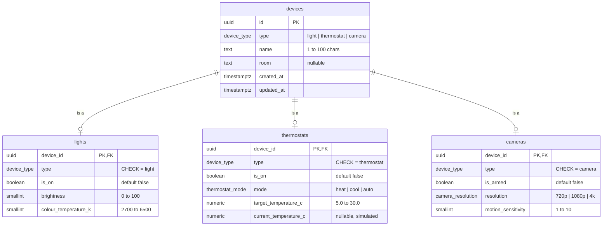
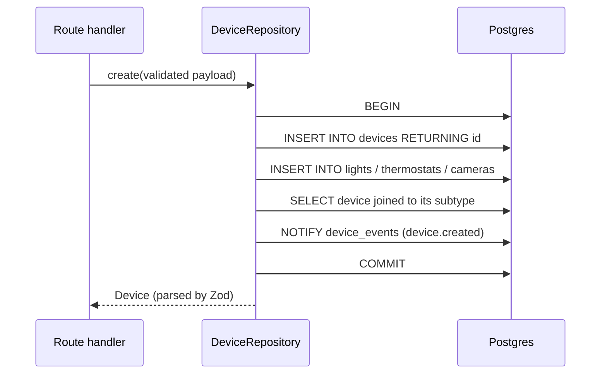
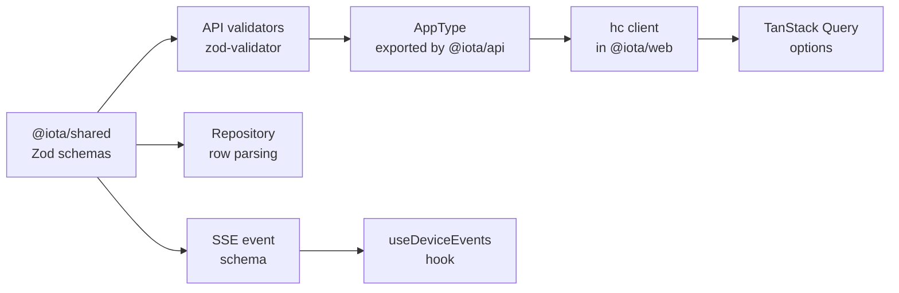
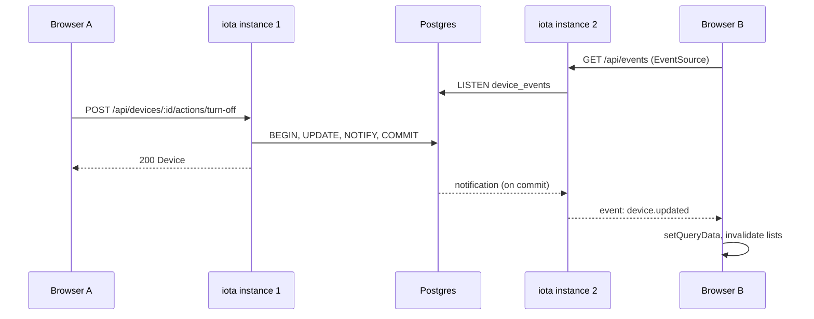
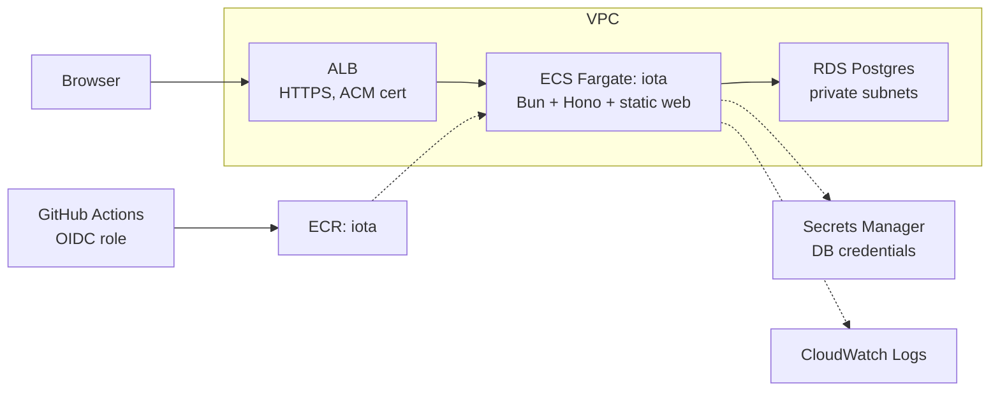

# iota: Design Document

Design for iota, a small smart home device manager built as a take-home
exercise. Status: draft, 23 September 2026.

## Overview

iota registers and controls smart home devices: a Hono API on Bun backed by
Postgres, and a React frontend that holds no device state of its own. The
emphasis is on structure, state management and the frontend/backend
contract rather than visual polish.

### Requirements

| Requirement | Where it is met |
| --- | --- |
| Register a new device | `POST /api/devices`, `/devices/new` route |
| View a list of devices | `GET /api/devices`, `/` route |
| View a device's details | `GET /api/devices/:id`, `/devices/$id` route |
| Update status or configuration | `PATCH /api/devices/:id` for settings; `POST /api/devices/:id/actions/:action` for commands |
| Delete a device | `DELETE /api/devices/:id` |
| Perform a device action from the frontend | Action buttons on the detail view (turn on/off, arm/disarm) |
| Frontend uses the API, not its own state | TanStack Query cache over the Hono RPC client; Postgres is the single source of truth |

### Scope

Three device types: lights, thermostats and security cameras. No
authentication, no physical device integration and a single implicit home;
these are recorded as assumptions below.

## Technology stack

TypeScript end to end on Bun, with strict compiler settings in every
workspace.

| Concern | Choice | Rationale |
| --- | --- | --- |
| Runtime and package manager | Bun | Fast installs, workspaces, built-in test runner and Postgres client |
| HTTP framework | Hono | Small, typed routing; RPC client (`hc`) gives end-to-end types without codegen |
| Database | Postgres 17 | Relational constraints suit a typed device model; runs locally in Docker Compose |
| Data access | `Bun.sql`, hand-written SQL | No ORM layer to explain; tagged templates parameterise automatically; built-in `LISTEN`/`NOTIFY` |
| Validation | Zod v4 + `@hono/zod-validator` | One schema drives request validation, row parsing and client types |
| Frontend | React + Vite | HMR and a mature plugin ecosystem; `/api` proxied to Hono in development |
| Routing | TanStack Router (code-based) | Typed params and loaders that integrate with TanStack Query |
| Server state | TanStack Query | Caching, invalidation and refetching without a hand-rolled store |
| Styling | Open Props + plain CSS | Design tokens without a component library |
| Lint and format | Biome | One tool and one config for TS, JSON and CSS |
| Infrastructure as code | Terraform | Widely used, declarative style is more reliable than imperative approaches. |
| Hosting | AWS ECS Fargate, RDS, ALB | Supports long-lived SSE connections; managed Postgres |

## Repository structure

A Bun workspaces monorepo with two apps and one shared package. The only
cross-app dependency is a type-only import of the API's `AppType` into the
web app.

```text
iota/
├─ apps/
│  ├─ api/                    @iota/api
│  │  ├─ src/
│  │  │  ├─ app.ts            Hono app composition, exports AppType
│  │  │  ├─ index.ts          Bun.serve entry point
│  │  │  ├─ db.ts             Bun.sql client from configuration
│  │  │  ├─ routes/           devices.ts, events.ts
│  │  │  ├─ repositories/     devices.ts (SQL, row parsing)
│  │  │  ├─ actions/          per-type action handler map
│  │  │  ├─ events/           DeviceEventBus (LISTEN/NOTIFY)
│  │  │  └─ errors.ts         problem details onError handler
│  │  ├─ migrations/          0001_init.sql, ...
│  │  ├─ scripts/migrate.ts
│  │  └─ test/
│  └─ web/                    @iota/web
│     ├─ src/
│     │  ├─ api/              hc client, query keys, query options
│     │  ├─ routes/           root, list, new, detail
│     │  ├─ components/       device cards, per-type forms and controls
│     │  ├─ hooks/            useDeviceEvents
│     │  └─ styles/           Open Props imports, app CSS
│     └─ vite.config.ts       /api proxy to :3000
├─ packages/
│  └─ shared/                 @iota/shared: Zod schemas and inferred types
├─ infra/                     Terraform
├─ docker-compose.yml         Postgres, init script for iota and iota_test
├─ Dockerfile                 multi-stage build, single runtime image
└─ biome.json
```

### Keeping server code out of the web bundle

The web app must never import runtime code from `@iota/api`. Two guards
work together.

Biome's `noRestrictedImports` has no option to allow type-only imports
while banning value imports; the rule treats both the same, and adding
an `allowTypeImports` option equivalent to typescript-eslint's is an open
feature request. It does support `allowImportNames`, so the web workspace
restricts `@iota/api` to the single name `AppType`:

```json
{
  "overrides": [
    {
      "includes": ["apps/web/**"],
      "linter": {
        "rules": {
          "style": {
            "noRestrictedImports": {
              "level": "error",
              "options": {
                "paths": {
                  "@iota/api": {
                    "allowImportNames": ["AppType"],
                    "message": "apps/web may only import the AppType type from @iota/api."
                  }
                }
              }
            }
          }
        }
      }
    }
  ]
}
```

`AppType` is a type, so with `verbatimModuleSyntax` enabled TypeScript
rejects any import of it that is not `import type`, and the import is
erased at build time. Between them, Biome limits what can be imported and
the compiler guarantees it carries no runtime code.

## Data model

Devices use class table inheritance: a `devices` base table holds what
every device shares, and one table per type holds type-specific state,
keyed one-to-one on the device id.

### Entity relationship diagram



The diagram shows each device having at most one row in each subtype
table; the constraints below narrow that to exactly one row, in the table
matching its type.

### Constraints

- `devices.id` defaults to `gen_random_uuid()`; `devices` also has
  `UNIQUE (id, type)` so subtype tables can reference the pair.
- Each subtype table carries a `type` column fixed by `CHECK`, and its
  foreign key is `(device_id, type) REFERENCES devices (id, type) ON DELETE
  CASCADE`. A light row therefore cannot point at a thermostat.
- Ranges (brightness, colour temperature, target temperature, sensitivity)
  are `CHECK` constraints, mirrored in the Zod schemas so the API rejects
  bad input before the database does.
- `device_type`, `thermostat_mode` and `camera_resolution` are Postgres
  enums.
- "Every device has exactly one subtype row" cannot be expressed with plain
  constraints; the repository guarantees it by inserting both rows in one
  transaction.
- Device type is immutable after registration; PATCH schemas do not accept
  a different type.
- Operational state (`is_on`, `is_armed`) may be supplied at registration
  and defaults to off or disarmed when omitted.

### Registering a device



The transaction runs through `sql.begin()`. A failure in either insert
rolls back both, and the notification sent inside the transaction is
discarded with it.

### Reads

List and detail queries `LEFT JOIN` all three subtype tables. The
repository maps each row to the shared `Device` discriminated union and
parses it with Zod, since `Bun.sql` returns untyped rows. `updated_at` is
set by the repository on every write, in the same transaction as the
subtype update.

### Migrations

Numbered plain SQL files in `apps/api/migrations`. `scripts/migrate.ts`
applies unapplied files in order, each in its own transaction, recording
them in a `schema_migrations (version text PRIMARY KEY, applied_at
timestamptz)` table. The same script runs locally, in the test preload and
as a one-off ECS task.

## API design

A JSON API under `/api`, with settings changed by PATCH and operational
state changed by named actions.

### Endpoints

| Method | Path | Body | Success | Errors |
| --- | --- | --- | --- | --- |
| GET | `/api/devices?type=&room=` | none | 200, `Device[]` | 400 |
| POST | `/api/devices` | `CreateDevice` union | 201, `Device`, `Location` header | 400 |
| GET | `/api/devices/:id` | none | 200, `Device` | 404 |
| PATCH | `/api/devices/:id` | `UpdateDevice` union | 200, `Device` | 400, 404, 409 |
| POST | `/api/devices/:id/actions/:action` | none | 200, `Device` | 404, 422 |
| DELETE | `/api/devices/:id` | none | 204 | 404 |
| GET | `/api/events` | none | 200, `text/event-stream` | none |
| GET | `/api/health` | none | 200 when the database responds | 503 |

### Settings versus actions

The rule: PATCH changes persistent settings; actions change operational
state after registration.

| Type | Settings (PATCH) | Actions |
| --- | --- | --- |
| Light | name, room, brightness, colour temperature | `turn-on`, `turn-off` |
| Thermostat | name, room, mode, target temperature | `turn-on`, `turn-off` |
| Camera | name, room, resolution, motion sensitivity | `arm`, `disarm` |

This keeps commands explicit and auditable, and gives one place to reject
nonsense such as arming a light (422). Actions are resolved through a map
of `type → action → handler`, each handler a small pure function from
current state to next state, which makes them trivial to unit test.

Registration is the one exception: `CreateDevice` accepts an initial
`is_on` or `is_armed`, because a device joining the system may already be
running. Once registered, operational state changes only through actions.

### PATCH validation

The validator runs before the handler knows the device's type, so the
PATCH body carries `type` as its discriminator and is validated against
the matching per-type schema. If `type` does not match the stored device,
the API returns 409. This keeps request validation declarative in
`@hono/zod-validator`, so `hc` still infers the body type.

### Errors

All errors are RFC 9457 problem details (`application/problem+json`) with
`type`, `title`, `status`, `detail` and, for validation failures, an
`errors` array built from Zod issues. A single `app.onError` handler maps
domain errors (`DeviceNotFound`, `TypeMismatch`, `UnsupportedAction`) to
status codes; the Zod validator hook formats 400s the same way.

## Shared contract

Zod schemas in `@iota/shared` are the single definition of a device; every
type in iota is inferred from them, and no API types are written by hand.



Request shapes reach the frontend through `AppType` and `hc`; the SSE
event schema is imported directly, because `hc` does not type event
streams.

### Schemas

- `Device`: `z.discriminatedUnion("type", [Light, Thermostat, Camera])`,
  each extending a base object of id, name, room and timestamps.
- `CreateDevice`: the same union without server-owned fields (id,
  timestamps). Operational state is optional and defaults to off or
  disarmed.
- `UpdateDevice`: per-type partial settings, each carrying its `type`
  literal. Operational state is not accepted.
- `DeviceAction`: per-type action name enums, used for the `:action`
  param.
- `DeviceEvent`: `created | updated | deleted | resync`, carrying the
  device, its id, or nothing for `resync`.

### Conventions

- Timestamps are ISO 8601 strings in the schema (`z.iso.datetime()`),
  matching what JSON actually carries, so client types never claim a
  `Date` that is really a string.
- Hono routes are defined by method chaining so `AppType` retains every
  route's input and output types.
- `@iota/shared` has no runtime dependencies beyond Zod and is safe for
  both bundles.

## Frontend architecture

The iota frontend holds no device state of its own: the TanStack Query
cache is a view of the API, filled by `hc` calls and kept fresh by
mutations and SSE.

### Routes

| Path | View | Loader |
| --- | --- | --- |
| `/` | Device list, grouped by room, with a type filter | `ensureQueryData(devicesQuery())` |
| `/devices/new` | Registration form; fields switch on selected type, including initial on/armed state | none |
| `/devices/$id` | Detail, settings form and action buttons; delete | `ensureQueryData(deviceQuery(id))` |

Routes are code-based rather than file-based; with three routes, the
generated route tree adds machinery without saving effort. Loaders start
fetching on navigation, and components read the same data with
`useSuspenseQuery`.

### Server state

- Query keys live in one factory: `devices.all`, `devices.list(filters)`,
  `devices.detail(id)`.
- Query functions call `hc`, check `res.ok`, and throw a typed `ApiError`
  built from the problem details body.
- Mutations (create, update, action, delete) write the returned device
  into the detail cache with `setQueryData` and invalidate list queries.
  Updates are not optimistic; the API responds fast enough locally, and
  waiting keeps the UI honest about what the database holds.
- Action buttons disable while their mutation is pending, preventing
  double submissions.

### Local UI state

Form input and the list filter are the only client-side state. Forms use
controlled inputs with `useState`, validated with the shared Zod schemas
before submission, so client and server agree on the rules. The list
filter lives in the URL as a typed TanStack Router search param, so it
survives refresh and is shareable.

### Styling

Open Props supplies tokens (sizes, colours, radii, shadows) and its
normalise stylesheet. App CSS is a single plain file using those custom
properties, with `prefers-color-scheme` handled by Open Props. No
CSS-in-JS and no component library.

### Errors and loading

A root `errorComponent` renders problem details; a `notFoundComponent`
handles 404s on the detail route. Suspense boundaries show a minimal
loading state.

## Real-time updates

Server-sent events tell every open client when a device changes, and
Postgres `LISTEN`/`NOTIFY` carries those changes between iota instances.
Clients reconcile their cache from the event payload, so the database
remains the only source of truth.



Every instance, including the one that made the change, receives the
notification and forwards it to its own connected clients.

### Server

- `DeviceEventBus` exposes `publish(tx, event)` and `subscribe(listener)`.
  `publish` calls `tx.notify("device_events", JSON.stringify(event))`
  inside the mutation's transaction, so Postgres delivers it on commit and
  drops it on rollback. No separate "publish after commit" step is needed.
- Each process holds one `sql.listen("device_events", ...)` registration.
  Bun runs all listeners on a single dedicated connection and fans
  notifications out to an in-process `EventTarget`, which each SSE stream
  subscribes to.
- If the listening connection drops, Bun reconnects with exponential
  backoff and re-subscribes, but notifications sent while it was down are
  lost. The `onlisten` callback runs on every reconnect, and the bus uses
  it to emit a `resync` event to all local clients.
- Postgres limits a `NOTIFY` payload to just under 8000 bytes by default. A
  serialised device is well under 1 KB, so events carry the full device.
- `GET /api/events` uses `streamSSE` from `hono/streaming`, unsubscribing
  when the stream aborts, and sends a comment line every 20 seconds as a
  heartbeat to stay inside ALB idle timeouts.

### Client

- `useDeviceEvents`, mounted once in the root route, opens one
  `EventSource` for the app's lifetime.
- Each message is parsed with the shared `DeviceEvent` schema. `created`
  and `updated` write the device into its detail cache; `deleted` removes
  it; all three invalidate list queries.
- `resync`, and every (re)connection of the `EventSource` itself,
  invalidates all device queries, so anything missed is recovered by
  refetching. There is no event replay.

## Testing

Most confidence comes from API integration tests with `bun test` against a
real Postgres database, because the riskiest code is the SQL, the
constraints and the notification behaviour, which mocks would hide.

| Layer | What is tested | How |
| --- | --- | --- |
| API integration | Every endpoint: success, validation failures, 404, 409, 422, cascade delete, initial state at registration | `app.request()` against `iota_test`; no port, no network |
| Database constraints | A light row cannot reference a thermostat; range checks reject bad values | Direct SQL inserts expected to throw |
| Action handlers | Each type's actions produce the right next state; unsupported actions are rejected | Pure unit tests, no database |
| Events | A mutation produces exactly one notification; a rolled-back mutation produces none | `sql.listen` on `device_events` inside the test |
| Shared schemas | Edge values at each range boundary | Pure unit tests |

### Database lifecycle

- Docker Compose runs one Postgres container; an init script creates both
  `iota` and `iota_test`.
- A `bun test` preload file points the database configuration at
  `iota_test` and runs the migration script once.
- `beforeEach` truncates `devices` with `CASCADE`, giving each test a
  clean state.
- Test files run serially against the shared database to avoid truncation
  races.

### Frontend

Frontend tests are deliberately out of scope for this exercise; the typed
contract catches most integration mistakes at compile time. Playwright
end-to-end tests are listed under things not included.

## Tooling and local development

A reviewer should get from clone to a running iota with Docker and Bun
installed and three commands: `bun install`, `docker compose up -d`,
`bun dev`.

### Root scripts

| Script | Does |
| --- | --- |
| `bun dev` | Runs migrations, then the API (`bun --watch`, port 3000) and Vite (port 5173) together |
| `bun run migrate` | Applies pending migrations |
| `bun run seed` | Inserts a few example devices across rooms |
| `bun test` | API integration and unit tests against `iota_test` |
| `bun run check` | `tsc -b` across workspaces plus `biome check` |
| `bun run build` | Builds the web bundle and type-checks the API |

### Conventions

- Strict TypeScript everywhere (`strict`, `noUncheckedIndexedAccess`,
  `exactOptionalPropertyTypes`, `verbatimModuleSyntax`), with project
  references between workspaces.
- Biome for linting and formatting, one root `biome.json` with a web
  workspace override for import restrictions.
- Conventional Commits, so the history reads as a narrative of the
  decisions in this document.
- Configuration comes only from environment variables (`DATABASE_URL` or
  discrete `PG*` variables, and `PORT`), validated with Zod at startup; a
  committed `.env.example` documents them.

### Continuous integration

A GitHub Actions workflow runs `check` and `test` on every push, with
Postgres as a service container. It is small, but it shows the tests are
real and reproducible.

## Deployment

One iota container image, serving both the API and the built frontend,
runs on ECS Fargate behind an Application Load Balancer, with RDS Postgres
in private subnets; all of it defined in Terraform.



Hono serves the Vite `dist` with `serveStatic`, so the browser talks to one
origin and there is no CORS to configure. Because events travel through
Postgres `LISTEN`/`NOTIFY`, the service can run more than one task without
clients missing changes made through another task.

### Why Fargate over App Runner

App Runner applies a request timeout that would repeatedly cut long-lived
SSE connections. `EventSource` would reconnect, but the stream would be
unreliable. Fargate behind an ALB keeps connections open indefinitely,
provided traffic flows within the idle timeout, which the 20-second
heartbeat guarantees.

### Container image

A multi-stage `Dockerfile` on the official `oven/bun` image: install with
a frozen lockfile, build the web bundle, then copy the API source,
`@iota/shared`, migrations and `dist` into a slim runtime stage running as
a non-root user. The same image runs the service and the migration task,
with different commands.

### Terraform layout

| Module | Resources |
| --- | --- |
| `network` | VPC across two AZs; public subnets for the ALB, private subnets for ECS and RDS; VPC endpoints for ECR, Secrets Manager and CloudWatch Logs instead of a NAT gateway |
| `database` | RDS Postgres 17, `db.t4g.micro`, subnet group, security group allowing ECS only, `manage_master_user_password` for a rotated secret |
| `registry` | `iota` ECR repository with a lifecycle policy keeping the last 10 images |
| `service` | ECS cluster, task definition, service with deployment circuit breaker and rollback, ALB, target group health-checking `/api/health`, ACM certificate |
| `ci` | GitHub OIDC provider and a deploy role scoped to ECR push and ECS updates |

`infra/envs/dev` composes the modules with its own `terraform.tfvars`, and
all resources are named and tagged with an `iota-<env>` prefix. State
lives in S3 using the S3 backend's native lock file (Terraform 1.10+),
avoiding a DynamoDB lock table.

### Configuration and secrets

The RDS-managed secret holds a username and password rather than a
connection string. The task definition injects them as separate
environment variables alongside the host, and iota's config module accepts
either `DATABASE_URL` or discrete `PG*` variables. Each task uses one extra
database connection for its `LISTEN` registration, which the pool sizing
must allow for.

### Release pipeline

1. On merge to `main`, GitHub Actions assumes the deploy role via OIDC; no
   long-lived AWS keys.
2. Build the image, tag it with the commit SHA, push to ECR.
3. Run the migration as a one-off ECS task using the new image; fail the
   pipeline if it exits non-zero.
4. Register a new task definition revision and update the service; the
   circuit breaker rolls back if health checks fail.

Migrations must stay backwards compatible with the previous release,
because old tasks keep serving until the rollout completes.

## Assumptions

- There are no physical devices. The database is the source of truth, and
  actions simulate a device acknowledging instantly.
- One implicit home and no users; anyone who can reach iota can control
  every device.
- Rooms are free text on the device rather than their own entity.
- A thermostat's current temperature is a simulated, read-only value set
  at registration.
- A device may be registered already on or armed; if unspecified it starts
  off or disarmed.
- Device counts are small (tens), so list endpoints are unpaginated.

## Trade-offs

| Decision | Gain | Cost |
| --- | --- | --- |
| Class table inheritance | Real per-type constraints; no nullable columns for other types | Two-table writes; joins on read; a migration per new device type |
| `Bun.sql` over an ORM | Explicit SQL, no generated layer, minimal dependencies | Hand-written row mapping; migrations are self-built |
| PATCH plus actions | Commands are explicit and validated per type | Two update paths to explain and test |
| `type` in PATCH bodies | Declarative validation keeps `hc` inference | Slight redundancy in the request |
| SSE over polling | Instant cross-client updates with no wasted requests | Long-lived connections to manage behind the load balancer |
| `LISTEN`/`NOTIFY` as the event bus | Transactional delivery, multi-instance fan-out, no extra infrastructure | Notifications during a listener reconnect are lost, mitigated by `resync`; one extra connection per task |
| No optimistic updates | UI never shows state the database rejected | Actions wait on a round trip |
| Single image, same origin | No CORS; one artefact to deploy | Frontend and API scale and release together |
| Biome with `allowImportNames` | One lint tool across the repo | Cannot distinguish type and value imports; relies on the compiler for that half |

## Not included

- Authentication, users and per-home authorisation.
- Pagination and sorting on the device list.
- An action audit log (a `device_events` table would also enable SSE
  replay via `Last-Event-ID`).
- Real device protocols such as MQTT, and device online/offline status.
- Playwright end-to-end and frontend component tests.
- Observability beyond CloudWatch Logs: metrics, tracing, alarms.
