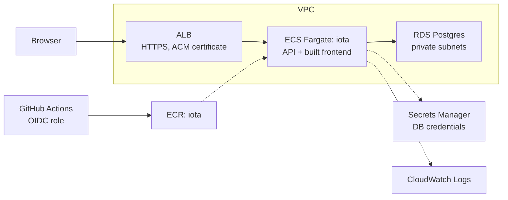

# iota

A small smart home device manager: a Hono API on Bun backed by Postgres,
and a React frontend that holds no device state of its own. Users can
register lights, thermostats and security cameras, view and filter them,
change their settings, turn them on and off or arm and disarm them, and
delete them. Every open browser sees changes as they happen, including
changes made from other windows.

| Concern | Choice |
| --- | --- |
| Runtime and package manager | Bun, with workspaces |
| API | Hono, validated with Zod v4 |
| Database | Postgres 17, accessed with `Bun.sql` and hand-written SQL |
| Real-time updates | Postgres `LISTEN`/`NOTIFY`, streamed to browsers over server-sent events |
| Frontend | React, Vite, TanStack Router and TanStack Query |
| API client | Hono RPC client (`hc`), typed from the server's routes |
| Styling | Open Props and plain CSS |
| Lint and format | Biome |
| Tests | `bun test` against a real Postgres database |

## Running the application

### Prerequisites

- Bun 1.3.9 or later, for `bun run --parallel`; developed on 1.4.2.
  Real-time updates rely on `Bun.sql`'s `LISTEN`/`NOTIFY` support, so
  run `bun upgrade` if you are on an older version.
- Docker with Compose v2, or Podman with `podman compose`. On macOS any
  runtime works (Docker Desktop, OrbStack or Colima).

### First run

```bash
bun install
cp .env.example .env
docker compose up -d
bun run seed
bun dev
```

Open <http://localhost:5173>. `bun dev` applies any pending migrations,
then runs the API on port 3000 and the Vite dev server on port 5173 in
parallel; Vite proxies `/api` to the API. `bun run seed` is optional and
adds seven example devices across four rooms. It refuses to run against a
database that already has devices; use `bun run seed --reset` to replace
them.

Compose starts one Postgres container with two databases: `iota` for
development and `iota_test` for the test suite. If port 5432 is already
in use, change the mapping in `docker-compose.yml` to `"5433:5432"` and
update both URLs in `.env`.

On Fedora or another SELinux system, add `,Z` to the init-script volume
in `docker-compose.yml` (`:ro,Z`), otherwise the container cannot read
the script that creates `iota_test`. Reset with `docker compose down -v`
if the container has already started without it.

### Scripts

All scripts run from the repository root.

| Script | Does |
| --- | --- |
| `bun dev` | Migrates, then runs the API and Vite together |
| `bun run dev:api` | Runs only the API, with file watching |
| `bun run migrate` | Applies pending migrations to `DATABASE_URL` |
| `bun run seed` | Inserts example devices into an empty database |
| `bun run test` | Runs every workspace's tests; needs Postgres running |
| `bun run typecheck` | Runs `tsc --noEmit` in every workspace |
| `bun run lint` | Runs `biome check` across the repository |
| `bun run format` | Applies Biome formatting |

### Configuration

| Variable | Used by | Purpose |
| --- | --- | --- |
| `DATABASE_URL` | API, migrations, seed | Postgres connection string |
| `PG*` (`PGHOST`, `PGUSER` and so on) | API | Alternative to `DATABASE_URL`, used in AWS |
| `TEST_DATABASE_URL` | Tests | Defaults to the Compose `iota_test` database |
| `PORT` | API | Defaults to 3000 |

The API validates its environment at startup and exits with a clear
message if neither `DATABASE_URL` nor `PGHOST` is set.

## Repository structure

```text
iota/
├─ apps/
│  ├─ api/            @iota/api: Hono app, repository, events, migrations, tests
│  └─ web/            @iota/web: Vite and React app
├─ packages/
│  └─ shared/         @iota/shared: Zod schemas shared by both apps
├─ docker/            Postgres init script
├─ docker-compose.yml
└─ biome.json
```

`@iota/shared` holds the single definition of a device. Request
validation, database row parsing, the frontend's form validation, the
typed API client and the event stream all derive from it; no API types
are written by hand.

## Assumptions

- There are no physical devices. The database is the source of truth, and
  an action such as "turn on" simulates the device acknowledging
  instantly.
- There is one implicit home and no users. Anyone who can reach the app
  can control every device.
- Rooms are free text on each device rather than a separate entity.
- A thermostat's current temperature is a simulated, read-only value,
  optionally supplied at registration.
- A device may be registered already on or armed; if not specified it
  starts off or disarmed. After registration, operational state changes
  only through actions.
- A device's type cannot change after registration.
- Device counts are small (tens), so lists are unpaginated.
- Target temperatures are set in half-degree steps, as on most real
  thermostats.

## How the frontend communicates with the backend

### Requests

The frontend calls the API through Hono's RPC client, `hc`, typed with
the `AppType` exported by `@iota/api`. The web app imports that type with
`import type`, so it is erased at build time and no server code reaches
the browser bundle. Paths, parameters, request bodies and response types
are all inferred from the server's route definitions; changing a route on
the server produces a type error in the frontend.

All requests go to the same origin. In development, Vite proxies `/api`
to the API; in production, the API would serve the built frontend itself
(see [Deployment](#deployment)). Neither needs CORS.

### API

| Method | Path | Purpose | Success | Errors |
| --- | --- | --- | --- | --- |
| GET | `/api/devices?type=&room=` | List devices, optionally filtered | 200 | 400 |
| POST | `/api/devices` | Register a device | 201 with `Location` | 400 |
| GET | `/api/devices/:id` | Get one device | 200 | 400, 404 |
| PATCH | `/api/devices/:id` | Change settings | 200 | 400, 404, 409 |
| POST | `/api/devices/:id/actions/:action` | Perform an action | 200 | 400, 404, 422 |
| DELETE | `/api/devices/:id` | Delete a device | 204 | 400, 404 |
| GET | `/api/events` | Server-sent event stream | 200 | |
| GET | `/api/health` | Checks the database responds | 200 | 503 |

Every error is an RFC 9457 problem details response
(`application/problem+json`) with a stable `type` such as
`urn:iota:problem:device-not-found`. Validation failures include an
`errors` array of field paths and messages, which the frontend shows next
to the relevant inputs.

### State management

The frontend keeps no copy of device state outside the TanStack Query
cache, which is a view of the API. Query functions call `hc` through a
small `unwrap` helper that turns non-2xx responses into a typed
`ApiError`, so failures reach Query as errors. Route loaders start
fetching on navigation with `ensureQueryData`, and pages read the same
cache entries with `useSuspenseQuery`.

Every write returns the updated device. Mutations put that device straight
into its detail cache entry and invalidate the list queries, since a
change can move a device between filtered lists. Updates are not
optimistic; the UI waits for the API to confirm each change.

The only client-side state is form input, which is read with `FormData`
on submit and validated with the shared Zod schemas before any request is
made, and the list's type filter, which lives in the URL.

### Live updates

1. Each write to the database runs in a transaction that also issues a
   Postgres `NOTIFY` carrying the changed device. Postgres delivers it
   only if the transaction commits.
2. Each API process holds one `LISTEN` connection and fans notifications
   out to its connected clients.
3. The browser opens one `EventSource` to `/api/events` for the lifetime
   of the app, and applies each event to the Query cache.
4. Whenever the stream connects or reconnects, the browser refetches
   everything, which recovers any events missed while disconnected.

Because events travel through Postgres, a change made through one API
instance reaches clients connected to any other. The header shows the
stream's status: live, reconnecting, or offline.

## Design decisions and trade-offs

### Class table inheritance for device types

A `devices` base table holds shared columns, and `lights`, `thermostats`
and `cameras` hold type-specific columns keyed one-to-one on the device
id. Each subtype table references `(id, type)` on the base table with a
`CHECK` fixing its type, so the database itself prevents a light row
attaching to a thermostat. Ranges such as brightness are `CHECK`
constraints that mirror the shared Zod schemas, and tests assert the two
agree.

The cost is that every write spans two tables, reads need joins, and a
new device type needs a migration. A single table with a JSONB column
would be more flexible but would give up the database-level guarantees.

### `Bun.sql` and hand-written SQL instead of an ORM

Queries are explicit and fully parameterised, and there are no runtime
dependencies for data access. The costs are hand-written row mapping
(snake_case to camelCase, and Postgres `numeric` arriving as a string)
and a small self-written migration runner. Rows are parsed through the
shared Zod schema at the repository boundary rather than cast, so the
rest of the API only sees validated objects.

### Settings through PATCH, operational state through actions

PATCH changes persistent settings such as brightness or target
temperature. Actions (`turn-on`, `turn-off`, `arm`, `disarm`) change
operational state. PATCH schemas are strict, so an `isOn` in a PATCH body
is rejected. This keeps commands explicit, gives one place to reject an
action a device type does not support (arming a light is a 422), and
would make an audit log straightforward to add. The cost is two update
paths to explain and test. Registration is the one exception: a device
can be created already on or armed.

The PATCH body carries the device `type` as a discriminator so it can be
validated declaratively before the handler knows which device it is for;
a mismatch with the stored device is a 409.

### Errors keep their meaning

A malformed id is a 400, because the request is invalid before the
device is looked up. An unknown action name is a 400, while a real action
on the wrong device type is a 422. Domain errors are thrown by the
repository and mapped to status codes in one place. Unexpected errors are
logged and returned as a generic 500, so internal details such as SQL
errors never reach the client.

### Transactional events over `LISTEN`/`NOTIFY`

`NOTIFY` inside the write's transaction means clients never hear about a
change that was rolled back, and no separate message broker is needed.
Notifications sent while an API process's `LISTEN` connection is down are
lost. Bun reconnects automatically, and the event bus then sends a
`resync` event telling every client to refetch. Each API process uses
one extra database connection for listening.

### Server-sent events instead of WebSockets or polling

Updates only flow from server to browser, so SSE is sufficient, works
over plain HTTP, and reconnects by itself. A comment line every 20
seconds keeps the connection inside Bun's idle timeout (raised to 30
seconds) and a load balancer's. There is no event replay; reconnecting
clients refetch instead, which is simpler and cheap at this scale.

### Type-only dependency from web to API

The web app type-checks the API's source to infer `AppType`, so its
TypeScript config includes Bun's types. The cost is that Bun and Node
globals such as `process` type-check in frontend code, even though they
would fail in a browser. The alternative is building the API to
declaration files first, which needs project references and a build step
the project otherwise does not need. Biome's `noRestrictedImports` limits
the web app to importing the `AppType` name from `@iota/api`; Biome cannot
distinguish type imports from value imports, so `verbatimModuleSyntax`
supplies the other half of the guarantee.

Each workspace runs its own `tsc --noEmit`, rather than a root
`tsc -b` with project references, for the same reason: Bun and Vite both
consume TypeScript source directly, so composite builds would add
configuration without benefit.

### Uncontrolled forms validated with the shared schemas

Forms are read with `FormData` on submit rather than held in `useState`.
Only the registration form's type selector is controlled, because it
decides which fields render. Registration defaults are read from the
shared schema, so the form cannot drift from the API. Browser validation
is disabled so the shared schema is the only source of error messages.

The settings form is keyed by the device's `updatedAt`, so it shows
current values whenever the device changes, including changes made in
another window. The cost is that such a change discards unsaved edits in
the form.

### Cache consistency

A device can reach the cache twice for one change, once from the mutation
response and once from the event stream, in either order. The cache only
accepts a device whose `updatedAt` is at least as recent as the cached
copy. When a device is deleted elsewhere, its detail entry is marked
stale without being refetched, so a window showing it does not flash an
error.

### Testing against a real database

The API tests run against `iota_test` through Hono's `app.request()`,
with no network port, covering routing, validation, SQL and constraints
together. A preload refuses to run unless the database name ends in
`_test`, migrates once, and truncates between tests. Valid requests use
Hono's typed test client, which exercises the same RPC types as the
frontend; invalid requests use raw requests, because the typed client
will not compile them. One test terminates the real `LISTEN` backend in
Postgres to prove the `resync` path works.

### Deliberate simplifications

- The migration runner takes no lock, because the deployment below runs
  exactly one migration task per release.
- There are no optimistic updates.
- Actions set absolute states, so they are idempotent: turning on a light
  that is already on succeeds.

## Deployment

The application has not been deployed. This section describes how it
could be deployed to AWS; the target is ECS Fargate behind an Application
Load Balancer, with RDS Postgres, all defined in Terraform.



### One container, one origin

A multi-stage `Dockerfile` on the official `oven/bun` image would install
with a frozen lockfile, run `vite build`, then copy the API source,
`@iota/shared`, the migrations and the built frontend into a slim runtime
stage running as a non-root user. The API would serve the built frontend
with Hono's `serveStatic`, falling back to `index.html` for client-side
routes; that fallback is not yet in the code. The same image runs the
service and the migration task, with different commands.

### Why Fargate rather than App Runner

App Runner applies a request timeout that would repeatedly cut the
long-lived SSE connections. Fargate behind an ALB keeps them open
provided traffic flows within the ALB's idle timeout, which the
20-second heartbeat guarantees. Because events travel through Postgres,
the service can run several tasks without clients missing changes made
through another task.

### Terraform layout

| Module | Resources |
| --- | --- |
| `network` | VPC across two availability zones; public subnets for the ALB, private subnets for ECS and RDS; VPC endpoints for ECR, Secrets Manager and CloudWatch Logs instead of a NAT gateway |
| `database` | RDS Postgres 17 (`db.t4g.micro`), subnet group, security group allowing only ECS, and `manage_master_user_password` for a rotated secret |
| `registry` | ECR repository with a lifecycle policy keeping the last ten images |
| `service` | ECS cluster, task definition, service with deployment circuit breaker and rollback, ALB, target group health-checking `/api/health`, ACM certificate |
| `ci` | GitHub OIDC provider and a deploy role scoped to ECR push and ECS updates |

An `infra/envs/dev` root module would compose the modules with its own
`terraform.tfvars`, naming and tagging everything with an `iota-<env>`
prefix. State would live in S3 using the S3 backend's native lock file
(Terraform 1.10 or later), which avoids a DynamoDB lock table.

### Secrets and configuration

The RDS-managed secret holds a username and password rather than a
connection string. The task definition would inject them as `PGUSER` and
`PGPASSWORD` alongside `PGHOST`, which `Bun.sql` reads directly and the
API's startup validation accepts. Database pool sizing must allow one
extra connection per task for `LISTEN`.

### Release pipeline

1. On merge to `main`, GitHub Actions assumes the deploy role through
   OIDC, so no long-lived AWS keys are stored.
2. Run typecheck, lint and tests, with Postgres as a service container.
3. Build the image, tag it with the commit SHA and push it to ECR.
4. Run the migration as a one-off ECS task using the new image, and fail
   the pipeline if it exits non-zero.
5. Register a new task definition revision and update the service. The
   circuit breaker rolls back if the new tasks fail their health checks.

Migrations must stay backwards compatible with the previous release,
because old tasks keep serving until the rollout completes.

The API already handles `SIGTERM`, which ECS sends before stopping a
task: it closes open event streams, waits for in-flight requests, then
closes the database pool.

## Not included

- The `Dockerfile`, the static file serving it depends on, the GitHub
  Actions workflow and the Terraform are described above but not written.
- Authentication, users, homes and authorisation.
- Frontend tests, both component tests and end-to-end tests with
  Playwright.
- Pagination and sorting options on the device list.
- An action audit log. A `device_events` table would also allow SSE
  replay with `Last-Event-ID` instead of refetching on reconnect.
- Real device protocols such as MQTT, and device online and offline
  status.
- Observability beyond logs to standard output: metrics, tracing and
  alarms.
- A lock in the migration runner, and zero-downtime migration tooling.
- A warning on the settings form when another window changes the device
  mid-edit, rather than resetting the form.
